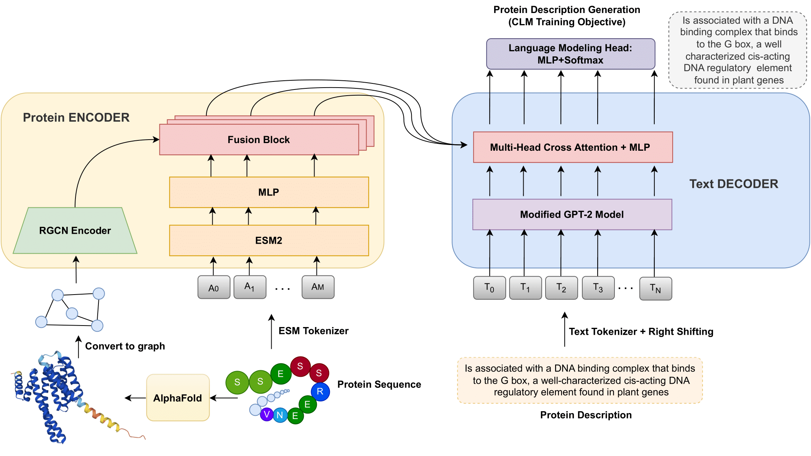

# Prot2Text: Multimodal Protein’s Function Generation with GNNs and Transformers
[](#python)
[![CC BY-NC-SA 4.0][cc-by-nc-sa-shield]][cc-by-nc-sa]
[![CC BY-NC-SA 4.0][cc-by-nc-sa-image]][cc-by-nc-sa]

[cc-by-nc-sa]: http://creativecommons.org/licenses/by-nc-sa/4.0/
[cc-by-nc-sa-image]: https://licensebuttons.net/l/by-nc-sa/4.0/88x31.png
[cc-by-nc-sa-shield]: https://img.shields.io/badge/License-CC%20BY--NC--SA%204.0-lightgrey.svg

<strong> Prot2Text is now on [HuggingFace](https://huggingface.co/collections/habdine/prot2text-suite-66e48fe3596fcff3e41be4e7) </strong>

This repository contains the code to reproduce the results of the paper "<strong>Prot2Text: Multimodal Protein's Function Generation with GNNs and Transformers</strong>" by <strong>Hadi Abdine, Michail Chatzianastasis, Costas Bouyioukos and Michalis Vazirgiannis</strong>, accepted at <strong>AAAI 2024</strong>. [Preprint Link](https://arxiv.org/abs/2307.14367)

Preliminary versions of the paper were accepted as a spotlight at [DGM4H@NeurIPS 2023](https://sites.google.com/ethz.ch/dgm4h-neurips2023/home?authuser=0) and [AI4Science@NeurIPS 2023](https://ai4sciencecommunity.github.io/neurips23.html). 

A demo web app for protein description generation could also be tested here [nlp.polytechnique.fr/prot2text](http://nlp.polytechnique.fr/prot2text#proteins).



## Setup
#### Environment Setup

The recommended environment is Python >= 3.8 and PyTorch 1.13, although other versions of Python and PyTorch may also work.

To prepare the environment we need to do the following steps:
1- Install pytorch 1.13.*, pytorch-geometric and its optional dependencies according to your cuda version using the following links (newer versions work):
- pytorch: [https://pytorch.org/get-started/previous-versions/](https://pytorch.org/get-started/previous-versions/)
- pytorch-geometric and its optional dependencies: [https://pytorch-geometric.readthedocs.io/en/latest/install/installation.html](https://pytorch-geometric.readthedocs.io/en/latest/install/installation.html)

2- Install the DSSP library (v3.0.0): [https://anaconda.org/salilab/dssp](https://anaconda.org/salilab/dssp) or newer [https://ssbio.readthedocs.io/en/latest/instructions/dssp.html](https://ssbio.readthedocs.io/en/latest/instructions/dssp.html) (the experiments in this study were done using dssp v3.0.0)

3- Install the rest of the requirements:
```bash
pip install -r Requirements.txt
```
The models are trained and tested using transformers v4.30.1. However, the repo is updated lately to work with transformers v4.40.2 as well.

4- Install graphein library from source or version >1.7.6 (if released):
```bash
git clone https://github.com/a-r-j/graphein.git
pip install -e graphein/
```

#### Datasets Preparation
|   Dataset   |  Size   |     Link     |
|:-----------:|:-------:|:------------:|
|  Train      | 248 315 | [Download](https://onedrive.live.com/download?resid=AE69638675180117%21289132&authkey=!AJwOr_jkRNBGiHY) | 
|  Validation |  4 172  | [Download](https://onedrive.live.com/download?resid=AE69638675180117%21289133&authkey=!ACVYLi69iXMJJ40) | 
| Test        |  4 203  | [Download](https://onedrive.live.com/download?resid=AE69638675180117%21289131&authkey=!AJweQhKxhF7lddw) |

After downloading the CSV file for each split, the PDB files will be downloaded from AlphaFoldDB and then preprocessed to extract the graph, the tokenized amino-acid sequence and the tokenized protein description for each PDB file.
Example for the test split:

```bash
python prepare_dataset.py \
  --data_save_path ./data/dataset/ \
  --split test \
  --csv_path ./data/test.csv \
  --plm_model facebook/esm2_t12_35M_UR50D \
  --decoder_model gpt2
```
where:
* `--data_save_path`: the path for the folder where the PDB files will be downloaded from AlphaFold and the graphs alongside the tokenized text sequence and the amino-acid sequence will be stored.
* `--split`: specify which split to preprocess (`train`, `eval`, or `test`).
* `--csv_path`: the path to a CSV file downloaded from the previous table.
* `--plm_model`: the HuggingFace protein language model path (used for amino-acid sequence tokenization).
* `--decoder_model`:  the HuggingFace decoder model path (GPT-like model) (used for natural text tokenization).

## Models

|  Model                     |  #params |  BLEU Score |  BERT Score |     Link     |
|:--------------------------:|:--------:|:-----------:|:-----------:|:------------:|
|  Prot2Text<sub>SMALL</sub> |  256M    |    30.01    |    82.60    | [Download v1.0](https://1drv.ms/u/s!AhcBGHWGY2muke8KlDdP__DNxHhB1g?e=5HHhtn) [Download v1.1](https://1drv.ms/u/s!AhcBGHWGY2muke5r13_Ew0mP_XkmCw?e=Daud3y) | 
|  Prot2Text<sub>BASE</sub>  |  283M    |    35.11    |    84.30    | [Download v1.0](https://1drv.ms/u/s!AhcBGHWGY2muke8JOhbc2e4zGCNCiA?e=XGsl7R) [Download v1.1](https://1drv.ms/u/s!AhcBGHWGY2muke5pg1mohZpURZNgSQ?e=53BjOq) | 
|  Prot2Text<sub>MEDIUM</sub>|  398M    |    36.51    |    84.83    | [Download v1.0](https://1drv.ms/u/s!AhcBGHWGY2muke8LWGEjPfeIb0B-iA?e=4swFgn) [Download v1.1](https://1drv.ms/u/s!AhcBGHWGY2muke5s7RQUW45fK8BAjQ?e=zn7cvn) | 
|  Prot2Text<sub>LARGE</sub> |  898M    |    36.29    |    85.20    | [Download v1.0](https://1drv.ms/u/s!AhcBGHWGY2muke8MfBS7eC-NOHoKQQ?e=jHU9PT) [Download v1.1](https://1drv.ms/u/s!AhcBGHWGY2muke5tU-jgrZmNpOAXlg?e=p61QAr) | 
|  Esm2Text<sub>BASE</sub>   |  225M    |    32.11    |    83.21    | [Download v1.0](https://1drv.ms/u/s!AhcBGHWGY2muke8Icx929RSAmsLRNw?e=jxxW3g) [Download v1.1](https://1drv.ms/u/s!AhcBGHWGY2muke5qine4uqzRO_nDAQ?e=TSwrCv) | 

The reported results are computed using v1.0 (from the original paper). v1.1 uses the same architecture, it is only trained with some fixed bugs in the code. It has a similar performance to v1.0.

#### Protein Description Generation
To generate the description of a protein using any Prot2Text model (using `--model_path`) you need to specify the protein AlphaFoldDB ID (using `--protein_alphafold_id`) and have an internet connection in order to download the structure:
```
python generate_description.py \
  --model_path ./models/prot2text_base \
  --protein_alphafold_id P36108
```

You can also use the Esm2Text model to generate protein description based only on the amino-acid sequence (using `--protein_sequence`):
```
python generate_description.py \
  --model_path ./models/esm2text_base \
  --protein_sequence AEQAERYEEMVEFMEKL
```

#### Training Prot2Text 
To train Prot2Text model on a single GPU:
```
python train.py \
  --decoder_path gpt2 \
  --esm_model_path facebook/esm2_t12_35M_UR50D \
  --use_plm \
  --use_rgcn \
  --warmup_esm \
  --warmup_gpt \    
  --data_path ./data//dataset/ \
  --train_csv_path ./data/train.csv \
  --eval_csv_path ./data/eval.csv \    
  --batch_per_device 4 \
  --nb_epochs 25 \
  --nb_gpus 1 \
  --gradient_accumulation 64 \ 
  --lr 2e-4 \ 
  --save_model_path ./models/prot2text_base/ \
  --bleu_evaluation
```
where:
* `--decoder_path`: the HuggingFace text decoder model path (GPT-like model, i.e. `gpt2`, `gpt2-medium`) from which the decoder architecture will be used.
* `--esm_model_path`: the HuggingFace protein language model path (i.e. `facebook/esm2_t12_35M_UR50D`, `facebook/esm2_t30_150M_UR50D`) from which the PLM architecture will be used.
* `--use_plm`: whether to use PLM model in the encoder or not. if set, you need to pass the PLM path using `--esm_model_path`.
* `--use_rgcn`: whether to use RGCN to encode the structure of the protein or not. At least one of `--use_rgcn` and `--use_plm` must be used.
* `--warmup_esm`: if set, the PLM model weights will be initialized using the HuggingFace checkpoint, otherwise the weights will be initialized randomly.
* `--warmup_gpt`: if set, the decoder model weights will be initialized using the HuggingFace checkpoint, otherwise the weights will be initialized randomly.
* `--data_path`: the path used to prepare the dataset (PDB files downloading and preprocessing). This will require running `prepare_dataset.py` on both `train` and `eval` splits.
* `--train_csv_path`: the path to the training CSV file downloaded from the first table. 
* `--eval_csv_path`: the path to the validation CSV file downloaded from the first table. 
* `--batch_per_device`: the batch size to be used on each GPU.
* `--nb_epochs`: the number of training epochs.
* `--nb_gpus`: the total number of GPUs used during the training (to compute the warming up steps).
* `--gradient_accumulation`: the gradient accumulation steps required to perform the optimization step.
* `--lr`: the learning rate to be used.
* `--save_model_path`: the path to save the model.
* `--bleu_evaluation`: if used, the model selection will be based on the best BLEU score on the validation dataset, otherwise the CLM (causal language modeling) loss will be used for model selection.

To train Prot2Text model on multiple GPUs:
```
python -u -m torch.distributed.run  --nproc_per_node <number_of_gpus> --nnodes <number_of_nodes> --node_rank 0 train.py \
  --decoder_path gpt2 \
  --esm_model_path facebook/esm2_t12_35M_UR50D \
  --use_plm \
  --use_rgcn \
  --warmup_esm \
  --warmup_gpt \    
  --data_path ./data//dataset/ \
  --train_csv_path ./data/train.csv \
  --eval_csv_path ./data/eval.csv \    
  --batch_per_device 4 \
  --nb_epochs 25 \
  --nb_gpus <number_of_gpus> \
  --gradient_accumulation 1 \ 
  --lr 2e-4 \ 
  --save_model_path ./models/prot2text_base/ \
  --bleu_evaluation
```
An example script for distributed training using SLURM can be also found in this repository.


#### Evaluation

To evaluate Prot2Text model (using `--model_path`) on the test set using a single GPU:
```
python evaluate_prot2text.py \
  --model_path ./models/prot2text_base \
  --data_path ./data/dataset/ \
  --split test \
  --csv_path ./data/test.csv \
  --batch_per_device 4 \
  --save_results_path ./results/prot2text_base_results.csv
```


To evaluate Prot2Text model on multiple GPUs:
```
python -u -m torch.distributed.run  --nproc_per_node <number_of_gpus> --nnodes <number_of_nodes> --node_rank 0 evaluate_prot2text.py \
  --model_path ./models/prot2text_base \
  --data_path ./data/dataset/ \
  --split test \
  --csv_path ./data/test.csv \
  --batch_per_device 4 \
  --save_results_path ./results/prot2text_base_results.csv
```
